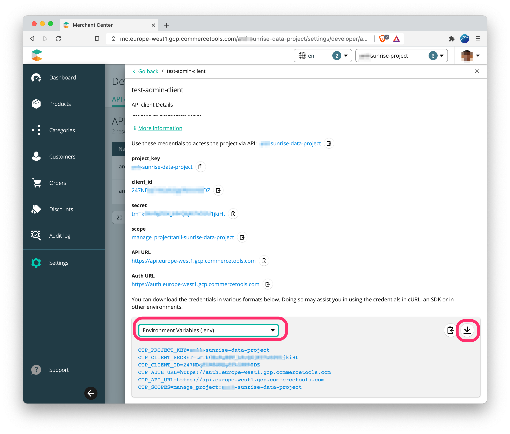

# Sunrise Data

[](https://travis-ci.org/commercetools/commercetools-sunrise-data)


## Prerequisites

1. Access to a commercetools Project and the Merchant Center. If you do not have a commercetools Project, follow our [Getting started guide](https://docs.commercetools.com/getting-started/initial-setup).
2. [Node.js](https://nodejs.org/en/download/) (version 10 or later) must be installed on your computer.

## Setting up your Sunrise Data project

1. [Clone](https://help.github.com/articles/cloning-a-repository/) this repository to your computer.
2. Go to the root of the project, where `package.json` is located, and install all node dependencies with:

```
npm install
```

3. [Create an API client](https://docs.commercetools.com/getting-started/create-api-client) in the Merchant Center.
4. Download the `Environment Variables (.env)` file.



6. Rename this file `.env` and move it to the root of the project.


## Commands

1. Clean all existing Project data and import new:

    ```
        npm run start
    ```

2. Clean project data:

    ```
        npm run clean:data
    ```

3. Import Project data:

    ```
        npm run import:data
    ```

4. Clean or import certain data *(e.g. Categories, Products, Customers, etc.)*

    ```
        npm run clean:categories
    ```

    or

    ```
        npm run import:products
    ```
    or

    ```
        npm run import:customers
    ```
